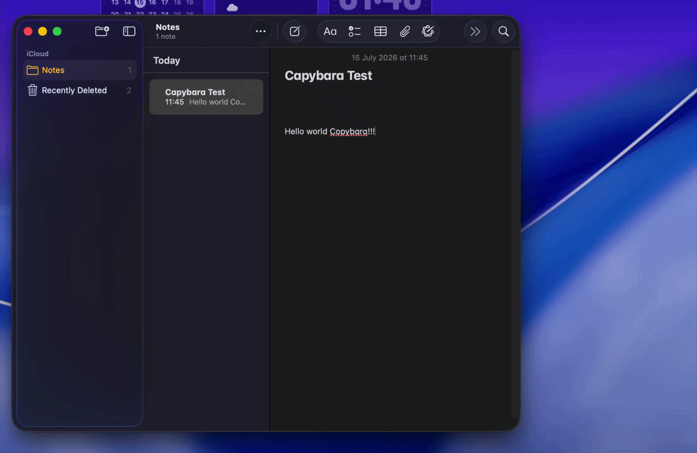

<p align="center">
  
</p>

<h1 align="center">Copybara</h1>

<p align="center">A lightweight clipboard manager for macOS that lives in your menu bar.</p>

<p align="center">
  
</p>

## Features

- **Clipboard history** — everything you copy is captured automatically: plain text, rich text (HTML), and images
- **Instant access** — summon the clipboard popup anywhere with a global shortcut (default <kbd>⌥</kbd><kbd>⌘</kbd><kbd>X</kbd>, customizable)
- **Paste on select** — picking a clip pastes it straight into the app you're working in
- **Pin clips** you want to keep around; remove the ones you don't; **Clear All** when you want a fresh start
- **Clip details** — inspect any history item in a dedicated info window
- **Stays out of your way** — the popup auto-hides when you're done, remembers its position per display, and there's no dock icon
- **Fits your setup** — light/dark/system appearance, adjustable clip font size and preview lines, open at login

## Install

Grab the latest `.dmg` from the [Releases](https://github.com/hkyselov/copybara/releases) page, open it, and drag **Copybara** into **Applications**.

### First launch

Copybara isn't notarized by Apple (it's a free, open-source project without a paid developer account), so macOS will warn you on first launch. To open it:

1. Double-click Copybara — macOS will say it "could not verify" the app. Click **Done**.
2. Open **System Settings → Privacy & Security**, scroll down, and click **Open Anyway**.
3. Confirm one more time.

Or, if you prefer the terminal, clear the quarantine flag instead:

```bash
xattr -cr /Applications/Copybara.app
```

### Accessibility permission

To paste a selected clip into the active app, Copybara simulates <kbd>⌘</kbd><kbd>V</kbd>, which requires the **Accessibility** permission (**System Settings → Privacy & Security → Accessibility**). macOS will prompt you the first time. If pasting stops working after an update, re-grant the permission — unsigned apps can lose it when the binary changes.

## Development

```bash
git clone https://github.com/hkyselov/copybara.git
cd copybara
npm install
npm start
```

Requires Node.js and npm. The app is built with [Electron](https://www.electronjs.org/) and [Electron Forge](https://www.electronforge.io/).

### Building the .dmg

```bash
npm run mac
```

The universal (Intel + Apple Silicon) disk image lands in `out/make/`.

## License

[MIT](LICENSE)
